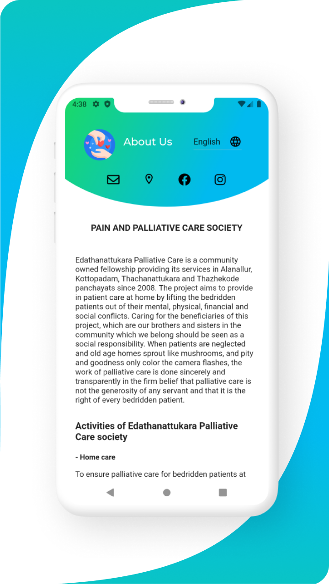
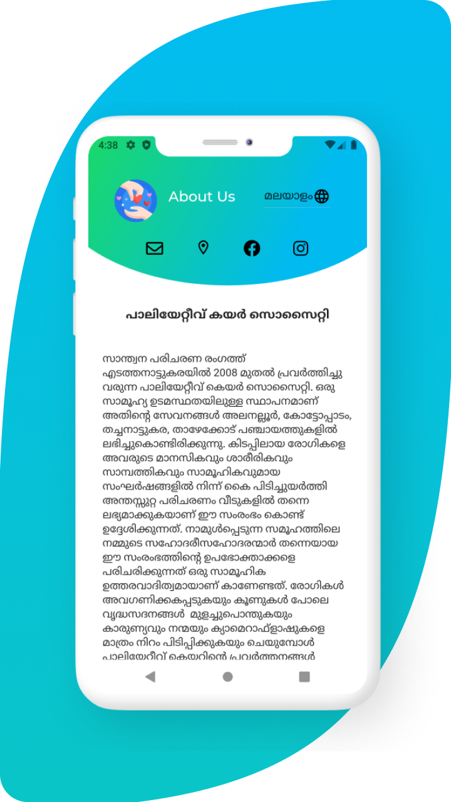

Mobile application for palliative care edathunattukara society.

# About palliative

Edathanattukara Palliative Care is a community owned company providing its services in Alanallur, Kottopadam, Thachanattukara and Thazhekode panchayats since 2008. The project aims to provide inpatient care at home by lifting the bedridden patients out of their mental, physical, financial and social conflicts. Caring for the beneficiaries of this project, which are our brothers and sisters in the community which we belong, should be seen as a social responsibility. When patients are neglected and old age homes sprout like mushrooms, and pity and goodness only color the cameraflashes, the work of palliative care is done sincerely and transparently in the firm belief that palliative care is not the
generosity of any servant and that it is the right of every bedridden patient.

### Latest release : v1.0.1

# Downloads:

## v1.0.1

                     

